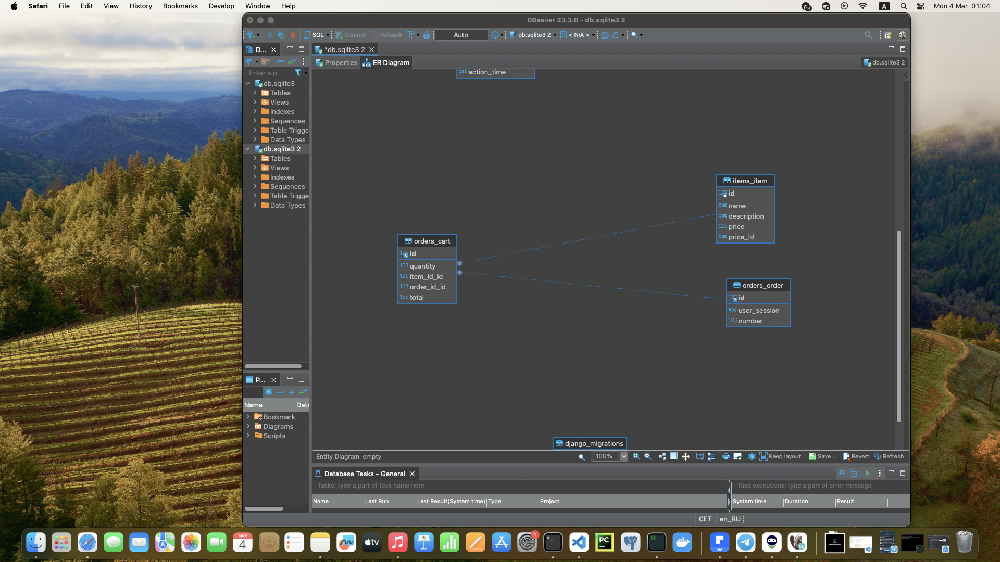
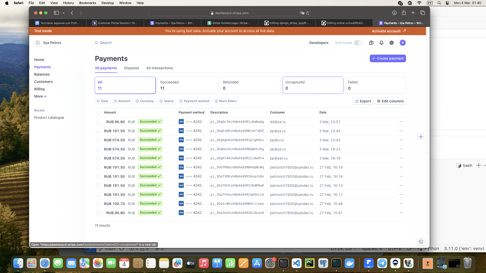

  

  
  
  
  

## Django+Stripe API
Веб-приложение на фреймворке Django, которое взаимодействует через API с платежной системой Stripe

## Архитектура приложения

  

## Ключевые особенности
- модель товара Item в приложении имеет поле price_id, которое является ссылкой на тот же товар в платежной системе Stripe
- при добавлении товара в корзину для каждого пользователя создается уникальный заказ через модель Order
- модель корзины Cart создается для конкретного товара и имеет внешние ключи на модели товара и заказа
- приложение производит расчет общего количества товаров в заказе и суммы заказа
- после успешной оплаты заказ и корзины, связанные с ним, удаляются из базы данных

## Как использовать
- зарегистрироваться и создать аккаунт на сайте stripe.com
- добавить товары в личном кабинете на сайте stripe.com
- склонировать данный репозиторий
- создать суперпользователя в приложении Django
- создать в корневой папке приложения файл .env и добавить в него переменную API_KEY, которое нужно взять из своего аккаунта stripe.com
- добавить товары в приложение Django через админ-панель, поле price_id брать из товаров в личном кабинете stripe.com
- товары должны отобразиться на стартовой странице
- добавить или удалить товары в корзину через страницу с товаром
- протестировать работу сервиса. Номер карты 4242 4242 4242 4242. Дата действия карты может быть любой, но позже текущего дня. CVV и имя пользователя также любые.

## Скриншот тестов

  

 
